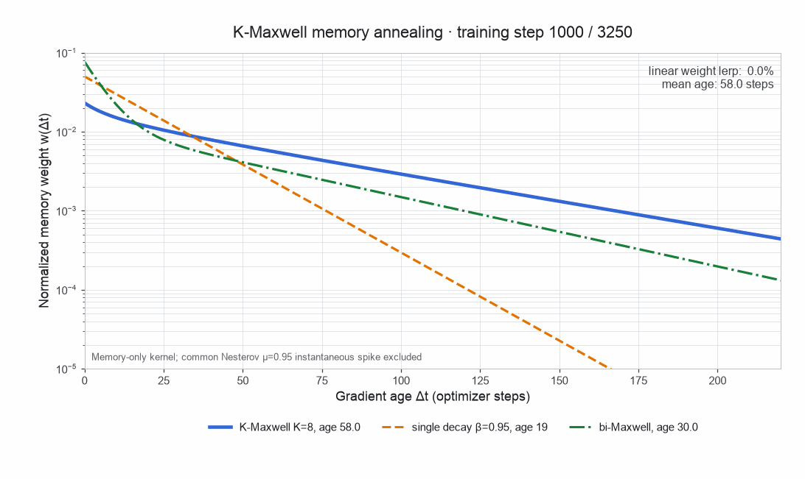
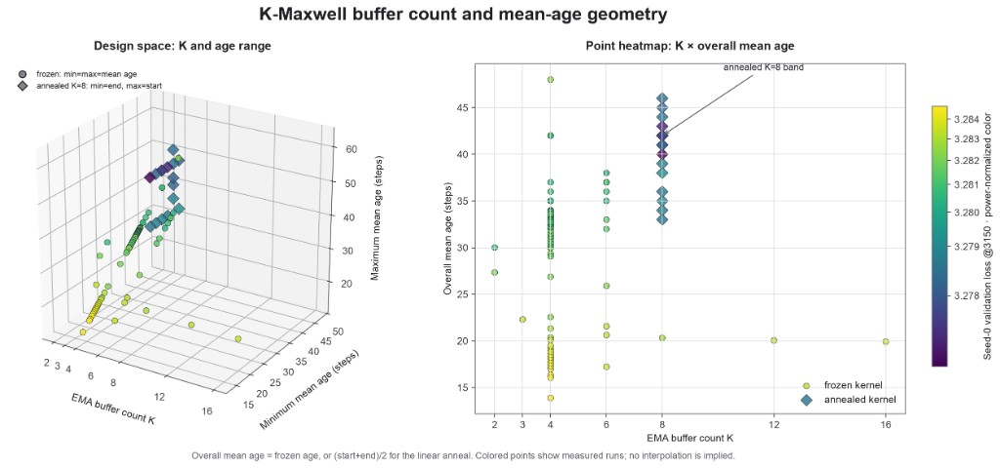
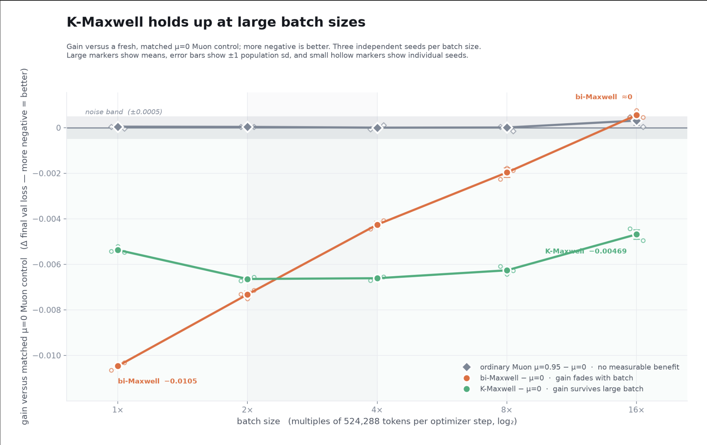

# K-Maxwell Momentum

Collaborator: Jeffrey Cheng

It is our belief that momentum remains an under-optimized area of pre-training. While recent research predominately focuses on improving the optimizer family itself, momentum has mostly remained a single EMA buffer with a fixed decay. [[1]](#ref-1), [[2]](#ref-2)

## Results

| Configuration and source | Baseline → K-Maxwell steps | Reduction | Runs and reported mean loss |
| --- | --- | --- | --- |
| Tuned Muon + auxiliary AdamW; submission #357 [[3]](#ref-3) | 3250 → 3160 | 90 steps; 2.77% | 8 seeds; 3.27794 |
| MuonH fast-slow decay; submission #359 [[4]](#ref-4) | 3125 → 3065 | 60 steps; 1.92% | 8 seeds; 3.27833 |
| SOAP-Muon + Tail-EMA + RowFloor + CWD; companion report [[5]](#ref-5) | 2690 → 2680 | 10 steps; 0.37% | 8 seeds; 3.27847 using Tail-EMA evaluation |

Our variant on single EMA momentum: K-Maxwell, achieves SOTA on Nano-GPT speed-run for both Muon, MuonH and the current world record SOAP optimizer, on Track 3 optimization. We surpass the previous world record by 90 steps (3% improvement in convergence speed) on Muon, and 60 steps on MuonH. However, K-Maxwell only surpasses the current world record by 10 steps on SOAP-Muon, and does not reach statistical significance in surpassing its predecessor Bi-Maxwell, which we believe is due to the overlapping objective of reducing oscillations at the edge of stability, which both momentum and SOAP-style preconditioning [[6]](#ref-6), aim to address.

However, we have found K-Maxwell generalizes well, and even improves at larger batch sizes, while Bi-Maxwell degrades, which suggests that the annealed momentum mix is not simply performing noise reduction.

## What is momentum doing?

Momentum is commonly thought of as a heavy ball carrying us through divots, saddle points and other local minima. However this is only partly true, momentum is helping us converge faster by dampening the effect of pathological curvature, which can be expressed in the condition number. The condition number represents the ratio of largest and smallest eigenvalues of the Hessian.

$$\kappa =\dfrac{\lambda_{max}}{\lambda_{min}}$$

In neural network optimization, assuming full batch gradient descent and a convex loss surface, the Polyak momentum variant pushes us faster along directions of low curvature, while dampening oscillations along directions of high curvature - which analytically accelerates convergence on ill-conditioned loss surfaces, by changing the dependence on condition number from $\kappa$ to $\sqrt{\kappa}$ [[7]](#ref-7), [[8]](#ref-8).

This is quite intuitive as we can imagine momentum along a low curvature direction is accumulating persistent directions +g, +g, … while momentum along a high curvature direction is oscillating, or bouncing along the valley walls, with gradients frequently alternating sign: -g, +g, -g, +g, creating an implicit dampening effect. The reason for this oscillation is best explained by the fact that neural networks train on the edge of stability, an observation made by Cohen in 2021 [[9]](#ref-9), meaning training progresses towards high curvature directions, causing curvature to increase throughout training and then oscillate at the stability boundary $\dfrac{2}{\eta}$.

[▶ Watch the gradient descent animation](../public/images/k-maxwell/quadratic.mp4) (MP4)

**Figure 1. Convergence and divergence on a quadratic loss.** With learning rate η and curvature S, gradient descent converges when S < 2/η (left) and diverges when S > 2/η (right). Animation from the [Central Flows companion website](https://centralflows.github.io/part1/) [[18]](#ref-18); related edge-of-stability findings are discussed in [[9]](#ref-9).

Momentum effectively dampens oscillations at the edge of stability, which allows us to take on a higher learning rate of $\dfrac{2+2\beta}{\lambda_{max}}$, while still ensuring convergence.

## K-Maxwell momentum

K-Maxwell momentum extends Bi-Maxwell [[10]](#ref-10) and AdEMAMix [[2]](#ref-2) by introducing 8 log-spaced EMA buffers, with decay rates ($\beta$) fixed. The starting mixture of the momentum buffers have a mean age of 58, and throughout training, linearly interpolates towards a mean age of 26, until step 3250. Training begins with a single EMA momentum buffer and switches to K-Maxwell at step 1000. [[3]](#ref-3)

$$m_{i,t}=\beta_i m_{i,t-1}+(1-\beta_i)g_t,
\qquad
\bar m_t=\sum_i w_i(t)m_{i,t}$$

The following pseudocode illustrates the annealed momentum after the switch step. Initialization and the surrounding optimizer are defined in the source trainer [[11]](#ref-11).

```python
# per Muon 2-D param, step >= 1000:
for k, beta in enumerate(kmaxwell_decay_rates):  # 8 log-spaced τ in [3, 64]
    m[k].lerp_(g, 1 - beta)
frac = (step - 1000) / 2250
w = (1 - frac) * w_age58 + frac * w_age26        # mixture mean age 58 → 26
m_eff = sum(w[k] * m[k] for k in range(8))
update = g.lerp_(m_eff, mu)                       # Nesterov mix unchanged
```

We use log-spaced buffers because this allows us to capture meaningfully different timescales, as slower EMAs act as a low-pass filter [[12]](#ref-12) on faster frequencies and frequency characteristically behaves like:

$$\omega \approx\dfrac{1}{\tau}$$

But mean age does not elicit the true expressivity enabled by multiple EMA buffers. As discussed in AdEMAMix [[2]](#ref-2), a mixture of EMAs allows us to have substantial weight on the newest gradients while maintaining a longer tail of historic gradients.

| Memory | Mean age | Weight on the newest gradient |
| --- | --- | --- |
| Single EMA with β = 0.95 | 19 steps | 5% |
| Equal mixture of EMAs with mean ages 3 and 35 | 19 steps | ≈13.9% |

We believe that by maintaining meaningfully different timescales in every gradient step, we can remove predictable errors. Similar to Richardson extrapolation [[13]](#ref-13) that uses differing step-sizes to remove lower order errors, we use a weighted combination of different frequencies to attenuate to the recurring oscillations that occur at the edge of stability.

## Annealing momentum



**Figure 2. Annealing the memory kernel.** The weight assigned to each past gradient changes as K-Maxwell's mean age falls from 58 to 26 steps between training steps 1000 and 3250. The single EMA (β = 0.95; mean age 19) and Bi-Maxwell (mean age 30) are shown for comparison. The vertical axis is logarithmic. The common Nesterov contribution from the current gradient is excluded. [[14]](#ref-14)

We also observe that annealing momentum to a lower mean age at the end of training creates substantial gains compared to configurations without annealing. [[14]](#ref-14) We suspect this is due to higher momentum better maintaining persistent gradients during the extended *transient phase* of training, and providing greater responsiveness in the *final convergence phase* which is needed to adapt to frequent oscillations [[15]](#ref-15).



**Figure 3. Buffer count and mean-age sweep.** Circles represent fixed mean ages; diamonds represent annealed configurations. Color shows seed-0 validation loss at step 3150, with darker purple indicating lower loss. The left panel shows the minimum and maximum mean ages; the right uses the fixed age or the average of the annealing endpoints. These are individual measured runs, with no interpolation between points.

This aligns with the concern of momentum amplifying noise by internalizing random error, especially during the final phase of training where gradients frequently change sign and oscillate along directions of high curvature. The traditional approach is to normalize the gradient itself, by the root-squared gradient for example in scalar RMSProp which also slows convergence by shrinking the effective learning rate. It seems that annealing momentum may also do the trick, without delaying convergence.

One possible explanation is that long momentum memory becomes less useful during late-stage convergence, when retaining older gradient directions can delay the optimizer's response to changes in the loss landscape. Shortening that memory may improve responsiveness, although it also reduces noise smoothing. RMSProp addresses a related challenge by scaling each gradient component using its running root-mean-square magnitude [[16]](#ref-16) but typically slows late-stage convergence by reducing the effective learning rate. K-Maxwell momentum annealing seems to also do the trick without negatively impacting convergence.

## Extending to larger batch sizes

We also performed ablations on batch size, and found that K-Maxwell improves with larger batch sizes, while Bi-Maxwell degrades to the control which is Muon with single EMA momentum. We suspect this reflects a change in the role of momentum as training becomes less stochastic with larger batch size. Recent work on batch sharpness, which is the curvature encountered along each mini-batch's gradient direction, finds that momentum imposes a tighter stability constraint at small batch sizes. At larger batch sizes however, training approaches the optimizer's deterministic stability boundary, allowing it to explore sharper regions than in the small-batch regime. [[17]](#ref-17)



**Figure 4. Batch-size ablation.** Final validation-loss differences are measured against a fresh matched Muon control with µ = 0; lower values are better. One batch-size unit is 524,288 tokens per step. Large markers show means over three independent seeds, hollow markers show individual runs, and error bars show ±1 population standard deviation. The shaded band spans ±0.0005 loss.

One possible explanation is that K-Maxwell's changing memory profile remains useful as the balance between stochastic fluctuations and curvature-driven oscillations shifts. This could explain why its benefit persists even as larger batches reduce the need for noise smoothing, fluctuations persist which K-Maxwell's annealing dampens, whereas a fixed mixture such as Bi-Maxwell does not.

## Limitations

The GPU memory profile of K-Maxwell at larger model sizes is significant as it requires storing 7 additional EMA buffers on top of the single EMA, per parameter. This becomes prohibitively expensive at the trillion parameter model scale. We are actively working on more memory efficient momentum approaches.

Acknowledgements:

Thank you to Jerry Hong for assisting with this project. Baseline implementations and their contributors are credited in the linked experiment reports.

## References

<a id="ref-1"></a>[1] Kingma, D. P., & Ba, J. (2015). [*Adam: A method for stochastic optimization*](https://arxiv.org/abs/1412.6980). International Conference on Learning Representations.

<a id="ref-2"></a>[2] Pagliardini, M., Ablin, P., & Grangier, D. (2024). [*The AdEMAMix optimizer: Better, faster, older*](https://arxiv.org/html/2409.03137). arXiv.

<a id="ref-3"></a>[3] jacknzheng. (2026c, August 27). [*Track 3: Annealed K-Maxwell momentum on tuned Muon—3160 steps (n=8)*](https://github.com/KellerJordan/modded-nanogpt/pull/357) [Pull request #357]. GitHub.

<a id="ref-4"></a>[4] jacknzheng. (2026d, August 28). [*Track 3: K-Maxwell on MuonH fast-slow decay, 3065 steps (n=8)*](https://github.com/KellerJordan/modded-nanogpt/pull/359) [Pull request #359]. GitHub.

<a id="ref-5"></a>[5] jacknzheng. (2026a). [*Record: Track 3 optimization—Frozen K-Maxwell momentum on SOAP-CWD—2680 steps (n=8)*](https://github.com/jacknzheng/kmaxwell-sota/tree/track3-kmaxwell-sota/records/track_3_optimization/results/20260824_kmaxwell_2680) [Experiment report]. GitHub.

<a id="ref-6"></a>[6] Vyas, N., Morwani, D., Zhao, R., Kwun, M., Shapira, I., Brandfonbrener, D., Janson, L., & Kakade, S. (2024). [*SOAP: Improving and stabilizing Shampoo using Adam*](https://arxiv.org/abs/2409.11321). arXiv.

<a id="ref-7"></a>[7] Goh, G. (2017). [Why momentum really works](https://distill.pub/2017/momentum/). *Distill, 2*(4), Article e6. [doi:10.23915/distill.00006](https://doi.org/10.23915/distill.00006)

<a id="ref-8"></a>[8] Polyak, B. T. (1964). [Some methods of speeding up the convergence of iteration methods](https://doi.org/10.1016/0041-5553%2864%2990137-5). *USSR Computational Mathematics and Mathematical Physics, 4*(5), 1–17.

<a id="ref-9"></a>[9] Cohen, J. M., Kaur, S., Li, Y., Kolter, J. Z., & Talwalkar, A. (2021). [*Gradient descent on neural networks typically occurs at the edge of stability*](https://arxiv.org/abs/2103.00065). International Conference on Learning Representations.

<a id="ref-10"></a>[10] Hu, Y., Xiang, H., Gong, X., & Yu, H. (2026). [*A physical response-and-memory model for Muon optimization*](https://arxiv.org/abs/2608.22994). arXiv.

<a id="ref-11"></a>[11] jacknzheng. (2026e). [*train_gpt_kmaxwell_anneal.py*](https://github.com/jacknzheng/kmaxwell-sota/blob/master/records/track_3_optimization/results/20260826_kmaxwell_3160/train_gpt_kmaxwell_anneal.py) [Python source code]. GitHub.

<a id="ref-12"></a>[12] Smith, J. O., III. (2007). [*Introduction to digital filters: With audio applications*](https://www.dsprelated.com/freebooks/filters/Bandwidth_One_Pole.html). W3K Publishing.

<a id="ref-13"></a>[13] Israel, R. (2002, January 29). [*Richardson extrapolation*](https://personal.math.ubc.ca/~israel/m215/rich/rich.html). University of British Columbia.

<a id="ref-14"></a>[14] jacknzheng. (2026b). [*Record: Track 3 optimization—K-Maxwell annealed momentum on the tuned Muon baseline—3160 steps (n=8)*](https://github.com/jacknzheng/kmaxwell-sota/blob/master/records/track_3_optimization/results/20260826_kmaxwell_3160/README.md) [Experiment report]. GitHub.

<a id="ref-15"></a>[15] Sutskever, I., Martens, J., Dahl, G., & Hinton, G. (2013). [On the importance of initialization and momentum in deep learning](https://proceedings.mlr.press/v28/sutskever13.html). In S. Dasgupta & D. McAllester (Eds.), *Proceedings of the 30th International Conference on Machine Learning* (Vol. 28, pp. 1139–1147). PMLR.

<a id="ref-16"></a>[16] Hinton, G., Srivastava, N., & Swersky, K. (n.d.). [*Neural networks for machine learning: Lecture 6e—RMSProp: Divide the gradient by a running average of its recent magnitude*](https://www.cs.toronto.edu/~tijmen/csc321/slides/lecture_slides_lec6.pdf#page=29) [Lecture slides]. University of Toronto.

<a id="ref-17"></a>[17] Andreyev, A., Ananthkumar, A., Walden, M., Poggio, T., & Beneventano, P. (2026). [*Momentum further constrains sharpness at the edge of stochastic stability*](https://arxiv.org/html/2604.14108v1). arXiv.

<a id="ref-18"></a>[18] Cohen, J., Damian, A., Talwalkar, A., Kolter, J. Z., & Lee, J. D. (n.d.). [*Part I: How does gradient descent work?*](https://centralflows.github.io/part1/) Understanding Optimization in Deep Learning with Central Flows [Companion website].
